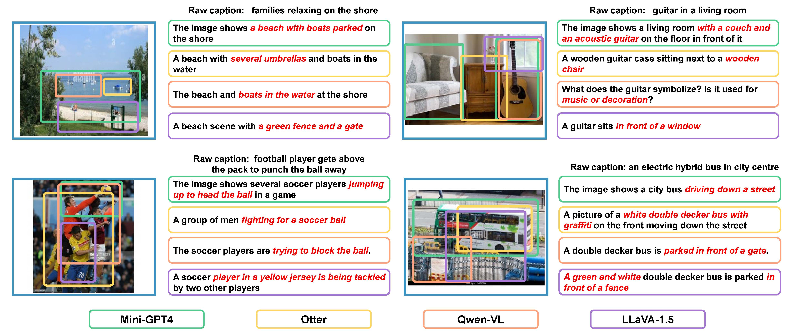

# MLLMs-Augmented Visual-Language Representation Learning

The official implementation of [MLLMs-Augmented Visual-Language Representation Learning](https://arxiv.org/pdf/2311.18765.pdf).

【3.12 Update⭐】We have released the code and the datasets!

## Abstract

Visual-language pre-training has achieved remarkable success in many multi-modal tasks, largely attributed to the availability of large-scale image-text datasets. In this work, we demonstrate that Multi-modal Large Language Models (MLLMs) can enhance visual-language representation learning by establishing richer image-text associations for image-text datasets. Our approach is simple, utilizing MLLMs to extend multiple diverse captions for each image. To prevent the bias introduced by MLLMs' hallucinations and monotonous language styles, we propose "text shearing" to maintain the quality and availability of extended captions. In image-text retrieval, without introducing additional training cost, our method consistently obtains 5.6 ~ 35.0 and 16.8 ~ 46.1 improvement on Recall@1 under the fine-tuning and zero-shot settings, respectively. Notably, we obtain zero-shot results that are comparable to fine-tuning on target datasets, which encourages more exploration of the versatile use of MLLMs. 

<div align=center><center></center></div>


## MLLMs-Augmented Datasets

You can access our enhanced datasets by this :
https://pan.baidu.com/s/1all0Mt_NeCwx79E-y94hRw?pwd=m2on

It contains the JSON files of three datasets: CC3M, CC12M, and YFCC15M. The captions are rewritten by MiniGPT-4, Qwen-VL, Otter, and LLaVA-1.5 respectively. Every JSON file contains N pairs {'image', 'caption'}. The 'image' stands for the path of the image file and the 'caption' is the textual description of the image.

Before use, you need to turn the image path in the JSON file into your local path first; then you can use multiple JSON files for joint training.

## Generate captions

We provide code for generating captions using MiniGPT-4, Qwen-VL, Otter, and LLaVA-1.5. You may need to download the model's weight following the official implementation. We provide the corresponding repository here:

MiniGPT-4: https://github.com/Vision-CAIR/MiniGPT-4.git

Qwen-VL: https://github.com/QwenLM/Qwen-VL.git

Otter: https://github.com/Luodian/Otter.git

LLaVA-1.5: https://github.com/haotian-liu/LLaVA.git

We keep the original README.md of the MLLMs in every model's folder to make it easier to get started.

You can generate captions by running:

```
conda env create -f environment.yml
conda activate xxxxx
sh ./model_name/generate.sh
```

Before generating captions, you may need to split the JSON file. And there is code for processing the JSON file in the folder './json_process'

After these operations, you can conduct the visual-language pretraining in a standard pipeline.

## Citation

If you found our work useful, please consider citing us.

```
@article{liu2023mllms,
  title={MLLMs-Augmented Visual-Language Representation Learning},
  author={Liu, Yanqing and Wang, Kai and Shao, Wenqi and Luo, Ping and Qiao, Yu and Shou, Mike Zheng and Zhang, Kaipeng and You, Yang},
  journal={arXiv preprint arXiv:2311.18765},
  year={2023}
}
```

## Acknowledgments

We thank [Yu Qiao](https://scholar.google.com.hk/citations?user=gFtI-8QAAAAJ&hl=zh-CN&oi=sra), [Ping Luo](https://scholar.google.com.hk/citations?user=aXdjxb4AAAAJ&hl=zh-CN&oi=sra), [Shou Mike Zheng](https://scholar.google.com.hk/citations?user=h1-3lSoAAAAJ&hl=zh-CN&oi=sra),  [Wenqi Shao](https://scholar.google.com.hk/citations?user=Bs9mrwwAAAAJ&hl=zh-CN&oi=sra), [Ziheng Qin](https://scholar.google.com/citations?user=I04VhPMAAAAJ&hl=zh-CN), [Zangwei Zheng,](https://zhengzangw.github.io/) [Xiangyu Peng](https://scholar.google.com/citations?user=KRUTk7sAAAAJ&hl=zh-CN), and [Ziyao Guo](https://scholar.google.com.hk/citations?user=FlZSxJMAAAAJ&hl=zh-CN&oi=ao) for valuable discussions and feedback.
